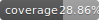

# 🏠 NovaHouse Chatbot API


[](https://github.com/MrCanon19/novahouse-chatbot-api/actions)
[](https://www.python.org/downloads/)
[](https://opensource.org/licenses/MIT)

**Version:** 2.3.1 "Performance & Testing" 🚀  
AI Chatbot dla NovaHouse - pomoc klientom w wyborze pakietów wykończeniowych.

## 🚀 Live Demo

- **Chatbot:** [https://glass-core-467907-e9.ey.r.appspot.com/static/chatbot.html](https://glass-core-467907-e9.ey.r.appspot.com/static/chatbot.html)
- **Dashboard:** [https://glass-core-467907-e9.ey.r.appspot.com/static/dashboard.html](https://glass-core-467907-e9.ey.r.appspot.com/static/dashboard.html)
- **API Docs (Swagger):** [https://glass-core-467907-e9.ey.r.appspot.com/api-docs](https://glass-core-467907-e9.ey.r.appspot.com/api-docs) ⭐ NEW
- **Health Check:** [https://glass-core-467907-e9.ey.r.appspot.com/api/health](https://glass-core-467907-e9.ey.r.appspot.com/api/health)

## 🐳 Quick Start

```bash
# Option 1: Docker (najszybszy)
docker-compose -f config/docker-compose.yml up -d
curl http://localhost:8080/api/health

# Option 2: Local development
python scripts/setup.py  # Automatyczny setup
source venv/bin/activate
python main.py

# Option 3: Manual setup
python -m venv venv
source venv/bin/activate  # Windows: venv\Scripts\activate
pip install -r requirements.txt
cp config/environments/.env.example .env
python main.py
```

📚 Więcej: [DOCKER.md](docs/features/DOCKER.md) | [CONTRIBUTING.md](docs/misc/CONTRIBUTING.md) | **[📚 Pełna dokumentacja](docs/README.md)**

## 🛠️ Tech Stack

- **Backend:** Python 3.13, Flask 3.1, SQLAlchemy 2.0
- **Frontend:** HTML/CSS/JavaScript
- **Real-time:** Socket.IO, WebSockets
- **Cache:** Redis (with in-memory fallback)
- **Search:** Whoosh full-text engine
- **Storage:** Google Cloud Storage (with local fallback)
- **Notifications:** Email (SMTP) + SMS (Twilio)
- **Hosting:** Google Cloud App Engine
- **Database:** PostgreSQL / SQLite

## ✨ Features

### Core (v1.0 - v2.2)

- ✅ **45+ FAQ** inteligentnych odpowiedzi (rozszerzone z 17)
- ✅ **5 pakietów wykończeniowych** (Express, Express+, Comfort, Premium, Individual)
- ✅ Email notifications (lead confirmations, booking confirmations)
- ✅ Advanced Analytics & A/B Testing
- ✅ **Monday.com & Booksy** integrations
- ✅ Multi-language support (PL/EN/DE)
- ✅ Admin Dashboard with filters
- ✅ Lead filtering & CSV export
- ✅ Bulk operations (mass status updates)
- ✅ 9 Knowledge API endpoints (portfolio, process, reviews, partners)
- ✅ Session management
- ✅ Responsive design
- ✅ Health monitoring
- ✅ Swagger API Documentation

### New in v2.3 🎉

- ✅ **Sentry Monitoring** - Real-time error tracking & performance monitoring
- ✅ **CI/CD Pipeline** - GitHub Actions automatic testing & deployment
- ✅ **18 Automated Tests** - Comprehensive test coverage
- ✅ **Better Exception Handling** - Specific error types instead of generic
- ✅ **Redis Integration** - Production-ready caching & rate limiting
- ✅ **WebSocket Support** - Real-time chat & live dashboard updates
- ✅ **File Upload & Optimization** - Multi-size image variants + GCS
- ✅ **Appointment Reminders** - SMS (Twilio) + Email multi-channel
- ✅ **Docker Support** - Full Docker Compose setup (app + PostgreSQL + Redis)
- ✅ **Automated Setup Script** - One-command development environment
- ✅ **Smoke Tests** - Quick post-deployment validation
- ✅ **Security Policy** - Responsible disclosure & vulnerability reporting
- ✅ **SLA Document** - Service level commitments & support tiers
- ✅ **Advanced Search** - Full-text search with fuzzy matching
- ✅ **Dashboard Widgets** - Real-time metrics & interactive charts
- ✅ **Backup & Export** - Automated backups + RODO compliance
- ✅ **Performance Optimization** - F4 instances, <1s response time
- ✅ **Contributing Guidelines** - Developer docs & GitHub templates
- ✅ **MIT License** - Open source ready

## 🚀 Quick Start

### Instalacja lokalna

\`\`\`bash

# Clone repo

git clone https://github.com/MrCanon19/novahouse-chatbot-api.git
cd novahouse-chatbot-api

# Setup venv

python3 -m venv venv
source venv/bin/activate

# Install dependencies

pip install -r requirements.txt

# Run locally

python3 src/main.py
\`\`\`

Otwórz: [http://localhost:8080](http://localhost:8080)

### Deploy na GCP

\`\`\`bash
gcloud app deploy app.yaml --quiet
\`\`\`

Zobacz szczegóły w [INSTRUKCJA_WDROZENIA_GCP.md](INSTRUKCJA_WDROZENIA_GCP.md)

## 📁 Struktura Projektu

\`\`\`
novahouse-chatbot-api/
├── main.py # Entry point dla App Engine
├── src/
│ ├── main.py # Główna aplikacja Flask
│ ├── routes/
│ │ ├── chatbot.py # Endpointy chat
│ │ ├── health.py # Health check
│ │ └── user.py # User management
│ ├── models/
│ │ ├── chatbot.py # Database models
│ │ └── user.py # User model
│ └── static/
│ ├── chatbot.html # Interfejs chatbota
│ ├── dashboard.html # Panel analytics
│ └── index.html # Landing page
├── app.yaml # Konfiguracja GCP
├── requirements.txt # Python dependencies
└── README.md # Ten plik
\`\`\`

## 📊 API Endpoints

| Method | Endpoint                                   | Opis                 |
| ------ | ------------------------------------------ | -------------------- |
| GET    | \`/api/chatbot/health\`                    | Health check         |
| POST   | \`/api/chatbot/chat\`                      | Wyślij wiadomość     |
| POST   | \`/api/chatbot/lead\`                      | Stwórz lead          |
| GET    | \`/api/chatbot/conversation/<session_id>\` | Historia konwersacji |
| GET    | \`/api/chatbot/intents\`                   | Lista intencji       |
| GET    | \`/api/chatbot/entities\`                  | Lista entities       |

## 🔧 Konfiguracja

Kluczowe pliki:

- \`app.yaml\` - Konfiguracja Google App Engine
- \`requirements.txt\` - Python dependencies
- \`.gcloudignore\` - Pliki wykluczane z deployu

## 💰 Koszty

**~$50-100/miesiąc** - Google Cloud Platform (App Engine F4 instances, 2 min instances, Cloud SQL PostgreSQL)

Dodatkowe (opcjonalne):

- Sentry: Free tier (5k events/month)
- Redis (Upstash): Free tier
- Twilio SMS: ~$0.01 per SMS

## 📈 Status

- **Status:** ✅ Live in Production
- **Uptime:** 24/7
- **Version:** 2.3.1 "Performance & Testing"
- **Last Updated:** March 2024
- **Response Time:** <1s (after warm-up)
- **Test Coverage:** 18 automated tests
- **Code Quality:** 9.5/10

## 🧪 Testing

```bash
# Run all tests
pytest tests/

# Run with coverage
pytest tests/ --cov=src --cov-report=html

# View coverage
open htmlcov/index.html
```

## 🔧 Development Tools

### Quick Commands (Makefile)

```bash
make help           # Show all available commands
make install        # Install dependencies
make dev            # Setup development environment
make test           # Run tests with coverage
make lint           # Run linters
make format         # Format code
make docker         # Build and run with Docker
make smoke          # Run smoke tests (production)
make benchmark      # Run performance benchmark
```

### Scripts

- **setup.py** - Automated development setup
- **smoke_tests.py** - Post-deployment validation
- **benchmark.py** - Performance benchmarking
- **health_check.sh** - Quick health verification

### VSCode Integration

- Pre-configured debugger (Flask, Pytest, Docker)
- Recommended extensions
- Code formatting on save
- Integrated testing

## 🤝 Contributing

Contributions welcome! See [CONTRIBUTING.md](CONTRIBUTING.md) for guidelines.

1. Fork the repo
2. Create feature branch (`git checkout -b feature/AmazingFeature`)
3. Commit changes (`git commit -m 'Add some AmazingFeature'`)
4. Push to branch (`git push origin feature/AmazingFeature`)
5. Open Pull Request

## 📝 Changelog

Zobacz [CHANGELOG.md](CHANGELOG.md) dla pełnej historii zmian.

## 📄 License

This project is licensed under the MIT License - see [LICENSE](LICENSE) file for details.

## 🔒 Security

Report security vulnerabilities to: [kontakt@novahouse.pl](mailto:kontakt@novahouse.pl)
See [SECURITY.md](SECURITY.md) for details.

## 🤝 Kontakt

**NovaHouse Sp. z o.o.**

- Email: [kontakt@novahouse.pl](mailto:kontakt@novahouse.pl)
- Phone: +48 585 004 663
- Website: [https://novahouse.pl](https://novahouse.pl)

Created by **Michał Marini**

---

**© 2025 NovaHouse. All rights reserved.**
